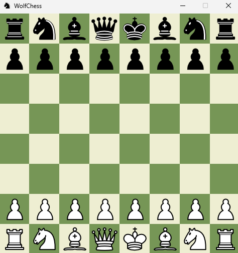
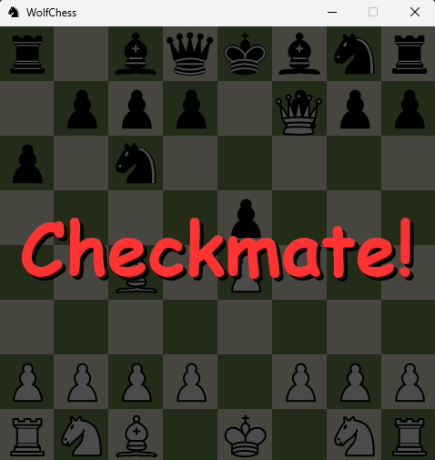

# 🐺 WolfChess

**WolfChess** is a complete 2D chess game built with **Pygame** and powered by **python-chess**. It features full rule support, animated piece movements, sound effects, and visual feedback for special events like check, checkmate, stalemate, castling, and promotions.

## 🎯 Features

- 🧠 Rule validation via `python-chess`
- 🎨 Pygame-based GUI with drag-and-drop movement
- 🏰 Full support for:
  - Castling (both sides)
  - En passant
  - Promotion (currently via console)
  - Check, checkmate, and stalemate
- 🔊 Sound effects for all game actions
- ⚔️ Visual feedback for special events like checkmate

## 🖼️ GUI Preview

| Game UI | In-game Move | Checkmate Effect |
|---------|---------------|------------------|
|  | .png) |  |

## 🕹️ Controls

- Click and drag pieces to move
- Move validation via `python-chess`
- Console prompt for pawn promotion (GUI version coming soon)

## 🧩 Requirements

- Python 3.8+
- `pygame`
- `python-chess`

Install with:

```bash
pip install pygame python-chess
